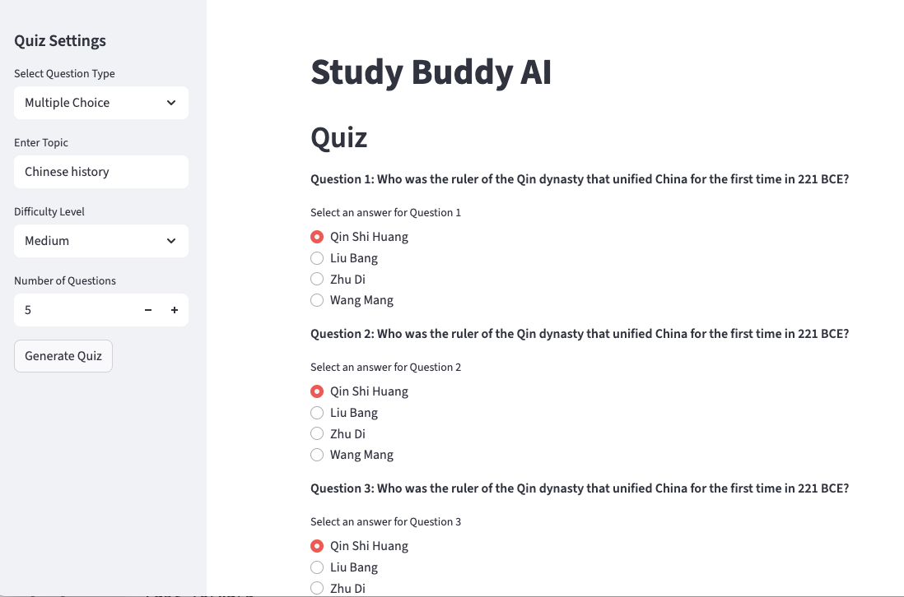

# AI Study Buddy

AI-powered quiz generator that creates multiple choice and fill-in-the-blank questions using Groq's LLM API.



## Features
- Generate MCQ and fill-in-the-blank questions
- Multiple difficulty levels  
- Results tracking with CSV export
- Automated CI/CD with Jenkins & ArgoCD

## Quick Start

**Prerequisites:** Python 3.12+ and [uv](https://github.com/astral-sh/uv)

```bash
# Setup
git clone <repository-url>
cd ai-study-buddy
./setup_dev.sh

# Configure API key
echo "GROQ_API_KEY=your_api_key_here" > .env

# Run
uv run streamlit run application.py
```

Visit `http://localhost:8501`

## Docker
```bash
docker run -p 8501:8501 --env-file .env slithice/studybuddy:latest
```

## CI/CD Pipeline
- **Jenkins**: Builds Docker images on code push
- **ArgoCD**: Deploys to Kubernetes cluster
- **DockerHub**: `slithice/studybuddy:latest`

## Project Structure
```
src/
├── generator/     # Question generation logic
├── llm/          # Groq API client
├── models/       # Pydantic schemas
├── prompts/      # LLM prompt templates
└── utils/        # Helper functions
```

## API Setup
1. Get [Groq API key](https://console.groq.com/)
2. Add to `.env`: `GROQ_API_KEY=your_key_here`
